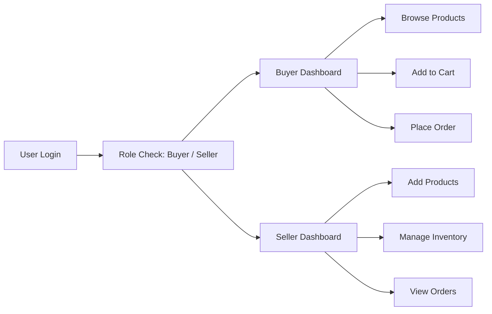
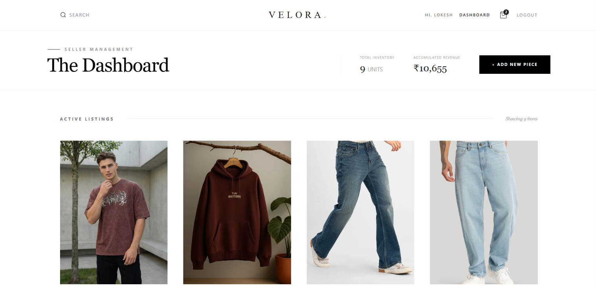
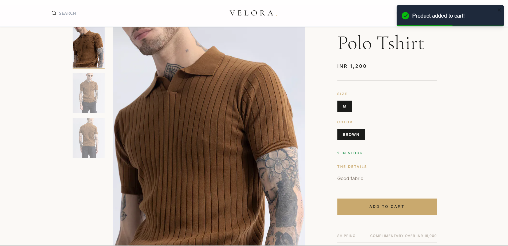
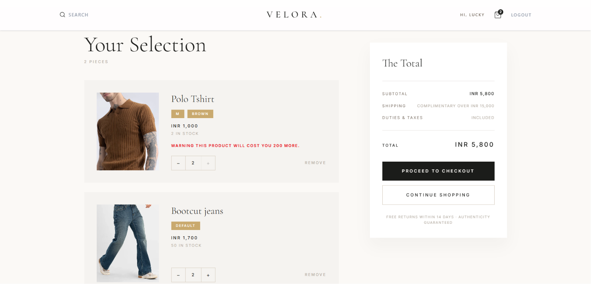
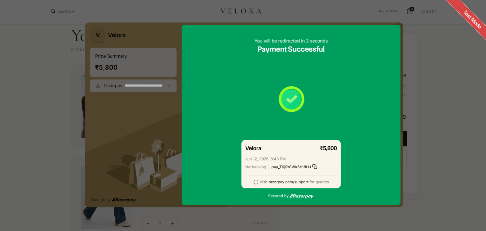
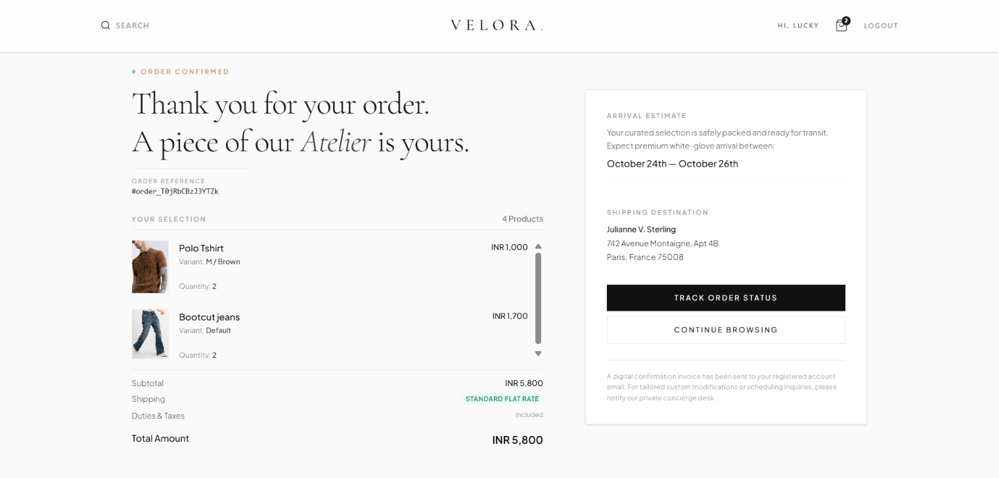

# 🛍️ Snitch (Velora) - Full Stack Ecommerce Platform

<p align="center">

**A scalable full-stack ecommerce application with role-based Buyer & Seller dashboards, secure authentication, cart system, and Razorpay payment integration.**

[](https://snitch-9ajg.onrender.com)
[]()
[]()
[]()

</p>

## 🚀 Live Demo

- **Website:** https://snitch-9ajg.onrender.com
- **Repository:** https://github.com/Lokesh-coder-tech/Snitch.git

---

# 📖 Overview

Snitch (Velora) is a production-style ecommerce platform built using the MERN stack.

It supports:

👤 Separate Buyer & Seller roles
🛒 Complete ecommerce flow (browse → cart → checkout → payment)
🧑‍💼 Seller dashboard for product & variant management
💳 Razorpay payment integration
🖼️ ImageKit-powered image uploads

The system is built with a modular backend architecture using MVC + Service pattern for scalability.r.

---

# ✨ Features

- 🛒 Buyer & Seller separate dashboards
- 📦 Product listing & management
- 🔐 Authentication & role-based access
- 🛍️ Add to cart & checkout flow
- 📊 Seller analytics dashboard
- 📁 Order management system
- ⚡ Fast and responsive UI
- 🧩 Modular backend architecture
- ☁️ Scalable API design

---

# 🛠 Tech Stack

| Layer | Technology |
|-------|------------|
| Frontend | React + Vite + Tailwind-CSS |
| Backend | Node.js + Express |
| Database | MongoDB |
| Auth | JWT |
| File Storage | ImageKit |
| Payment | Razorpay |
| Architecture | MVC + Service Layer |
| Deployment | Render |

---

# 🏗 Folder Structure

```text
snitch(velora)/
│
├── Backend/
│   ├── src/
│   ├── config/        # DB, ImageKit, Razorpay config
│   ├── controllers/  # Route controllers
│   ├── dao/           # Data access layer
│   ├── middlewares/   # Auth, validation, upload
│   ├── models/        # Mongoose schemas
│   ├── routes/        # API routes
│   ├── service/       # Business logic layer
│   ├── validator/     # Request validation
│   ├── public/
│   ├── app.js
│   ├── server.js
│   ├── package.json
│   └── .env
│
├── Frontend/
│   ├── src/
│   ├── app/           # App setup / routing
│   ├── features/      # Modular features
│   │   ├── auth/
│   │   ├── cart/
│   │   ├── product/
│   ├── shared/        # Reusable components/utils
│   └── main.jsx
│
├── public/
├── vite.config.js
└── package.json
```

# 🔄 Workflow



# 📡 API Endpoints

## 🔐 Auth

- `POST /api/auth/register` → Register user  
- `POST /api/auth/login` → Login user  

---

## 📦 Products

- `GET /api/products` → Get all products  
- `POST /api/products` → Add product (Seller only)  
- `PUT /api/products/:id` → Update product  
- `DELETE /api/products/:id` → Delete product  

---

## 🛒 Orders

- `POST /api/orders` → Place order  
- `GET /api/orders/my` → Get user orders  

---

# ⚙️ Installation

```bash
git clone https://github.com/Lokesh-coder-tech/Snitch.git
cd Snitch
```

Backend

```bash
cd Backend
npm install
npm run dev
```

Frontend

```bash
cd Frontend
npm install
npm run dev
```

---

# 🔑 Environment Variables

```env
NODE_ENV=production
MONGO_URI=your_mongodb_connection
JWT_SECRET=your_secret_key
IMAGEKIT_PRIVATE_KEY=your_imagekit_key
RAZORPAY_KEY_ID=your_razorpay_key_id
RAZORPAY_KEY_SECRET=your_razorpay_key_secret
```

> Replace the placeholder values with your own API keys before running the project.

---

## 📸 Screenshots

### Home Page


### Seller Dashboard


### Product Page


### Cart Page


### Payment Page


### Order-Success Page



---

# 🚀 Future Improvements

- Real-time order tracking
- Wishlist feature
- Product recommendation system
- Email notifications
- Admin analytics panel
- AI-based product suggestions

---

# 🤝 Contributing

Contributions are welcome.

1. Fork
2. Create a branch
3. Commit
4. Push
5. Open a Pull Request

---

# 👨‍💻 Author

**Lokesh Sharma**

- GitHub: https://github.com/Lokesh-coder-tech
- LinkedIn: www.linkedin.com/in/lokeshsharma-dev

---

# ⭐ Support

If you like this project, please **star the repository**.

---

# 📄 License

MIT License.

---

<p align="center">
Built with ❤️ by <b>Lokesh Sharma</b>
</p>
